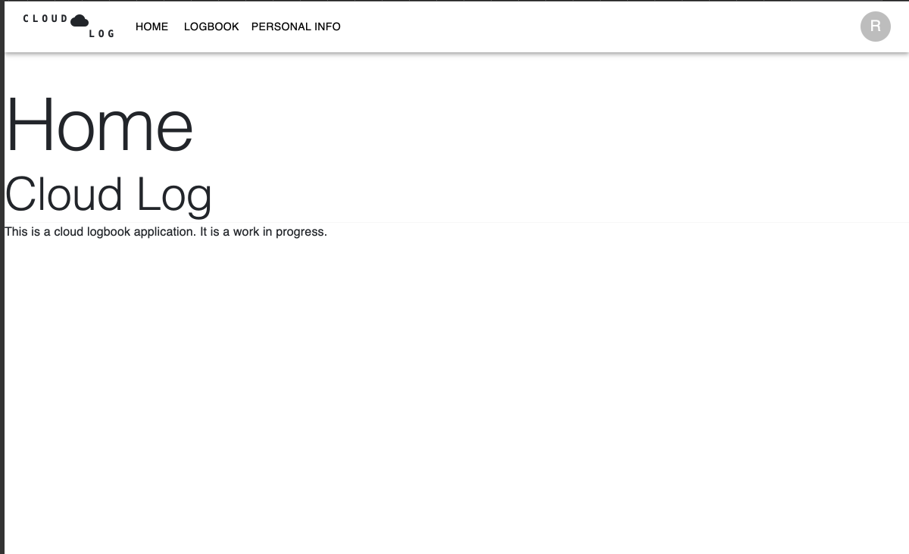
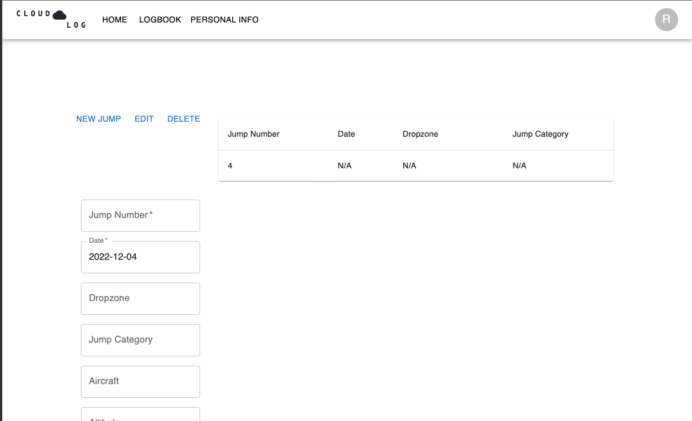
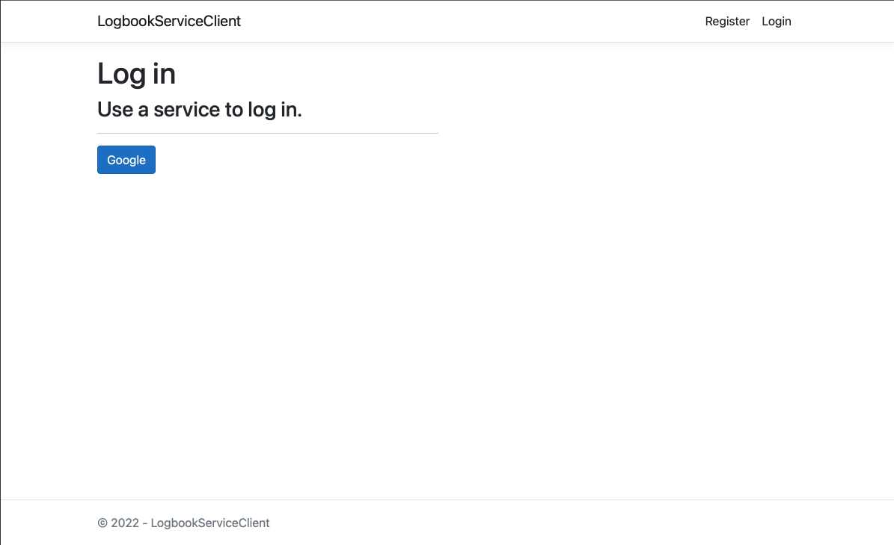

# Skydive-Logbook

## Introduction

Cloud Log is a web application that allows skydivers to track their skydives from an online platform.
Users can create an account and log and track their skydives from the web application. This project
was created as a solution to skydivers losing their physical logbooks. There is currently no online
platform that is specifically designed for skydivers to log their skydives. Cloud Log is a potential
solution to being able to track skydives online, venturing away from the traditional paper logbook.

## Status of the Project

Cloud Log is currently in the development phase. The backend is in a final state, but the frontend
is still in development.

## Documentation

The documentation for Cloud Log is available within the
[docs](docs) directory. 

- [SettingUp](docs/setting_up.md)


### Dependencies

- Docker Compose
- .NET6
- NodeJS
- NPM


```shell
$ docker-compose up -d
```

### Example

Home Page


Logbook Page


Login Page

