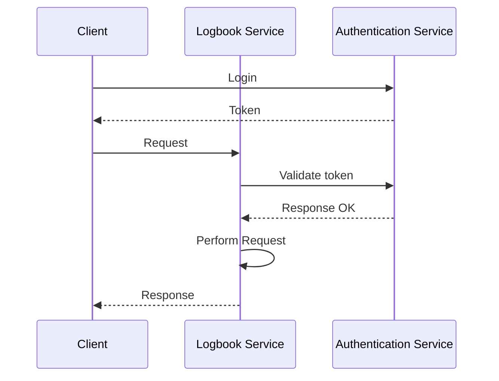
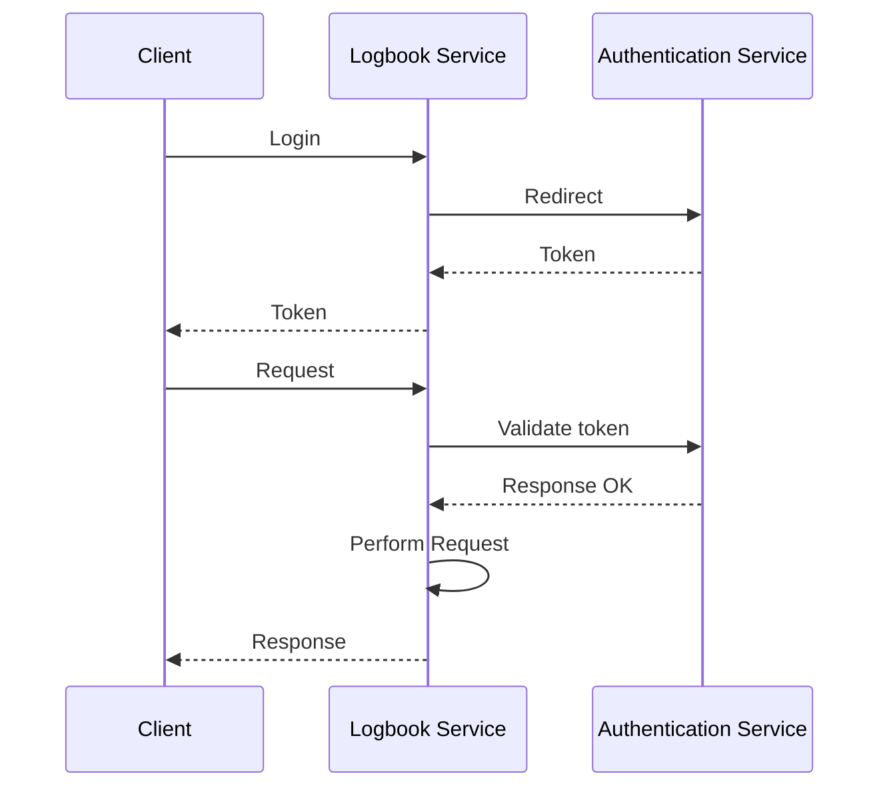
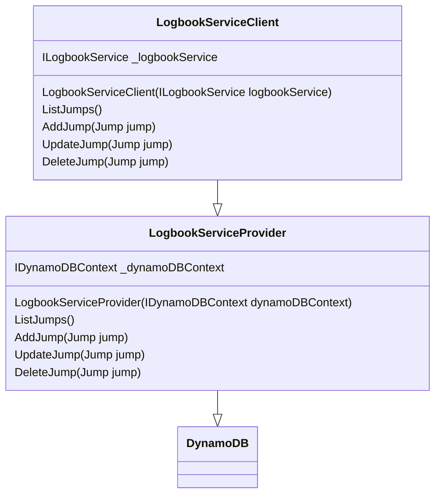

# Design Considerations

## Table of Contents

- [Authentication](#authentication)
- [Database](#database)

## Authentication
---

For the authentication, Cloud Log will use a third party
[OAuth 2.0](https://oauth.net/2/) protocol. This protocol is widely
used and supported by services like Google, Facebook, Twitter, etc.

For Cloud Log, the authentication procedure will be passed on to a
separate service, which will be responsible for the authentication.
This decision was made to avoid having to implement the authentication
procedure and store confidential information for the user. I didn't
want the program to have to store the user's password, email, etc.
Instead, I intend to use Google as the authentication provider and
use the user id to identify user information in the database.

I have two potential solutions for the authentication service:

1. Have the frontend send a login request to the authentication
service. The response will be a token to identify the user. Then
perform requests to the Logbook Service using the token.

Pro: Less work for the backend service. All it has to do is verify
the token.

Con: The frontend will have to call the authentication service
itself. This could make adding new authentication providers more
difficult.

2. Have the frontend send a login request to the Logbook Service.
The Logbook Service will then send a request or redirect to the
Authentication Service. The response will be a token to identify
the user.

Pro: The frontend will not have to call the authentication service.
It can send the request to the Logbook Service with the provider
name to use. This could make it easier to add new authentication.

Con: Could be more work for the backend service. Can also be more
difficult to implement and get working properly.

## Database
---

The database used for Cloud Log will be 
[DynamoDB](https://aws.amazon.com/dynamodb/). This is a NoSQL
database and is stored on the cloud.

Pro: NoSQL databases are more flexible and can be easier to
add new columns to a pre-existing table. This may be helpful
for adding new features to the application.

Con: Once the database provider is chosen, it will be difficult
to change if in the future I decide to change providers. This most
likely means the database will be locked in to AWS.

The diagram below shows the structure for onboarding DynamoDB
with the LogbookService only.

